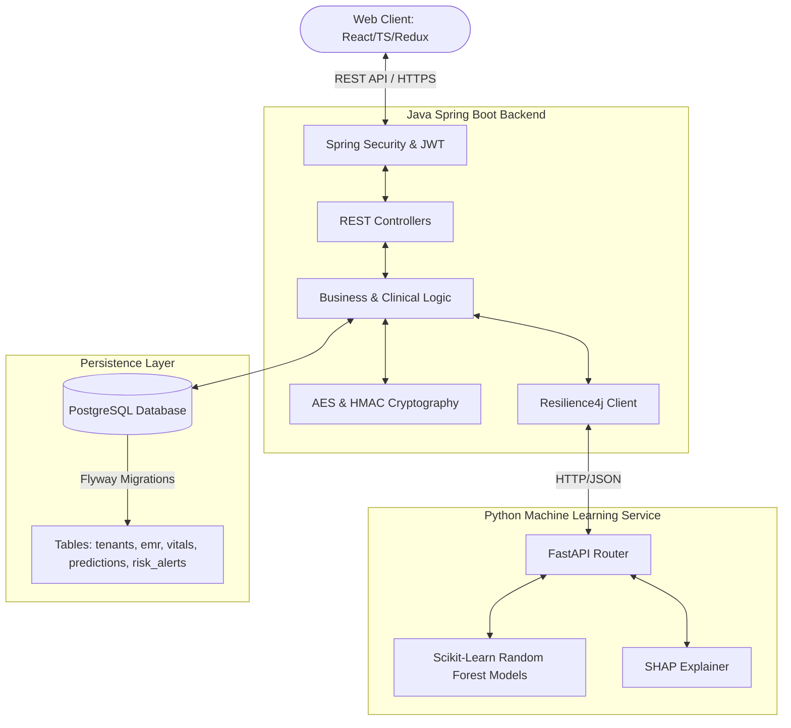

# PrivHealth AI 🏥🤖

PrivHealth AI is an enterprise-grade, multi-tenant Hospital Management System (HMS) integrated with a privacy-preserving Electronic Medical Records (EMR) platform, real-time doctor-patient queue workflows, longitudinal health tracking, and an **AI-powered Clinical Decision Support System (CDSS)** for multi-disease risk prediction.

---

## 🌟 Key Features

### 🏢 1. Multi-Tenant Foundation & RBAC
- **Strict Isolation**: Secure, tenant-keyed data isolation ensuring no crossover between different hospitals or clinics.
- **Role-Based Access Control (RBAC)**: Fine-grained permissions for **System Admins**, **Hospital Admins**, **Doctors**, **Receptionists**, and **Patients**.

### 🔒 2. Privacy-Preserving Security
- **Field-Level Encryption**: Cryptographic protection of Personally Identifiable Information (PII) such as Patient Name, Phone, and Email using authenticated **AES-256-GCM**.
- **Blind Indexing**: Searchable encrypted fields using **HMAC-SHA256** signatures, allowing secure record lookup without decryption.
- **Comprehensive Audit Logs**: Every medical access, EMR creation, and prediction generation is immutably logged for HIPAA/GDPR compliance.

### 📋 3. EMR & Interactive Clinic Operations
- **Electronic Medical Records**: Complete handling of clinical encounters, ICD-10 diagnoses, prescriptions, treatment notes, and lab reports.
- **Vitals & Symptom Journals**: Patient-facing logs for tracking blood pressure, heart rate, blood sugar, weight, and active symptoms.
- **Dynamic Queue Management**: Interactive patient queue dashboard with live statuses (Checked In, In Consultation, Completed) and doctor scheduling.

### 🧠 4. AI Risk Prediction & Clinical Decision Support (CDSS)
- **Multi-Disease Predictors**: Machine Learning models estimating risk scores and confidence levels for **Diabetes**, **Heart Disease**, and **Hypertension**.
- **Local ML Inference Service**: Python-based FastAPI microservice serving Random Forest classifiers.
- **Explainable AI (XAI)**: Generation of SHAP (SHapley Additive exPlanations) values to highlight exactly which patient vitals and symptoms contributed to a risk score.
- **Resilient Integration**: Spring Boot microservice integration wrapped with **Resilience4j Circuit Breakers, Retries, and Time Limiters** to guarantee backend uptime even if the ML service is offline.
- **Educational Patient Dashboard**: Translates complex ML jargon into a simplified "Health Score" (100 - avg risk), advisory categories, and actionable next steps.
- **Early Warning System**: Automated system alerts (Low, Medium, High, Critical) triggered by rising vitals or severe weight drops (>3kg in 14 days) to notify clinicians instantly.

---

## 🏗️ Architecture Overview



---

## 🛠️ Tech Stack

- **Frontend**: React 19, TypeScript, Vite, Tailwind CSS, Redux Toolkit, React Router, Recharts, Lucide Icons
- **Backend**: Java 21, Spring Boot 3.4, Spring Security, Hibernate ORM, Flyway (DB migrations), Resilience4j
- **ML Service**: Python 3.10+, FastAPI, Uvicorn, Scikit-learn, SHAP, Pandas, NumPy
- **Database**: PostgreSQL 16+
- **Containerization**: Docker & Docker Compose

---

## 🚀 Setup & Installation

### 📋 Prerequisites
Ensure you have the following installed on your system:
- **Java JDK 21**
- **Node.js (v18+) & npm**
- **Python (v3.10+)**
- **Docker & Docker Compose**

---

### 🗄️ 1. Database Setup
Start the PostgreSQL database container using Docker Compose from the root directory:
```bash
docker-compose up -d
```
This launches a PostgreSQL instance listening on port `5433` (as configured in `.env`).

---

### 🐍 2. ML Service Setup
Navigate to the `ml-service` directory:
```bash
cd ml-service
```
1. Create a Python virtual environment:
   ```bash
   python -m venv venv
   source venv/bin/activate  # On Windows use: venv\Scripts\activate
   ```
2. Install dependencies:
   ```bash
   pip install -r requirements.txt
   ```
3. Run the FastAPI development server:
   ```bash
   uvicorn app.main:app --reload --port 8000
   ```
The ML service is now running at `http://localhost:8000`.

---

### ☕ 3. Backend Setup
Navigate to the `backend` directory:
```bash
cd backend
```
1. Copy the environment variables template:
   ```bash
   cp ../.env.example .env
   ```
   *Note: Ensure the configurations in `.env` match your local environment credentials (e.g., PostgreSQL credentials, JWT secrets, etc.).*
2. Build and run the Spring Boot application:
   ```bash
   ./mvnw spring-boot:run
   ```
The backend API is now running at `http://localhost:8080` and database migrations will auto-execute via Flyway.

---

### ⚛️ 4. Frontend Setup
Navigate to the `frontend` directory:
```bash
cd frontend
```
1. Copy the environment variables template:
   ```bash
   cp .env.example .env
   ```
2. Install the frontend dependencies:
   ```bash
   npm install
   ```
3. Launch the Vite development server:
   ```bash
   npm run dev
   ```
Open `http://localhost:5173` in your browser to view the application.

---

## 🧪 Running Tests
To run unit and integration tests across the components:

- **Backend Tests**:
  ```bash
  cd backend
  ./mvnw test
  ```
- **ML Service Tests**:
  ```bash
  cd ml-service
  pytest
  ```

---

## 🛡️ Clinical Advisory & Safety Disclaimer
> [!IMPORTANT]
> **Advisory Only**: All predictions, alerts, risk scores, and recommendations generated by the PrivHealth AI clinical decision support system are advisory in nature. They are intended solely to support qualified healthcare professionals and do not constitute, nor should they replace, professional medical diagnosis, treatment, or clinical judgment. Patients should consult their doctors before making any medical decisions.
